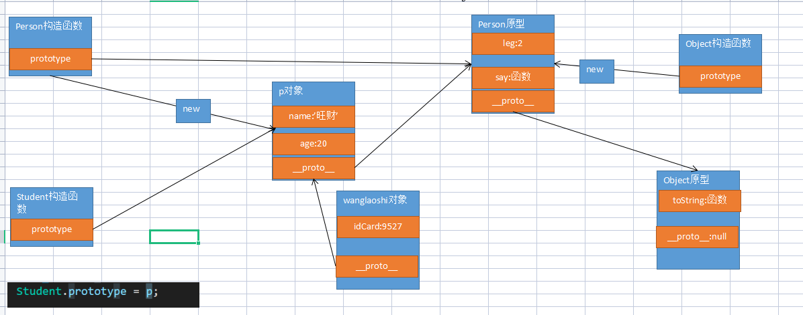
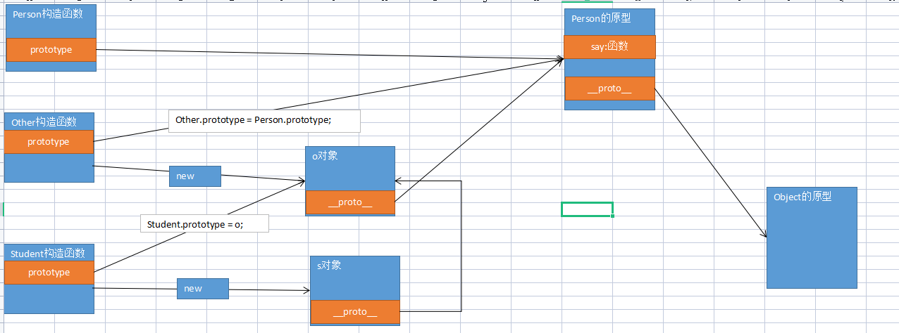

# 继承

## 继承的作用

```javascript
function Cat(name) {
    this.name = name;
}
Cat.prototype.eat = function () {
    console.log('能捕鱼');
}
Cat.prototype.run = function () {
    console.log('跑起来')
}


function Dog(name){
    this.name = name;
}
Dog.prototype.run = function(){
    console.log('跑起来')
}
// 上面的代码功能很正常 但是run方法对于每一个个体都是具备的能力，在构造函数中代码重复了。
// 可以通过使用继承设计一个更大的类 让Cat与Dog都继承整个更大的类
```

## 借用继承

1、call方法

```javascript
// 1、call方法的使用
        let obj = {};
        function fn(name, age) {
            obj.name = name;
            obj.age = age;
        }
        fn.call(obj, '赵春阳',38);
        console.log(obj);
```

2、使用call实现借用继承

```javascript
// 2、使用call实现借用继承
function Human(name) {
    this.name = name;
}
Human.prototype.run = function () {
    console.log('代码与人总有一个要跑');
}

function Student(idCard,...args) {
    this.idCard = idCard
    // 使用call实现借用继承
    // Student中的this 是谁在new就表示谁 此时表示的是zhangfei这个对象
    Human.call(this,...args);//将Human构造函数调用 并且修改Human中this为当前Student中this表示的对象
}
Student.prototype.sleep = function () {
    console.log('睡觉是学生的特殊能力');
}

let zhangfei = new Student('10101','张飞')
console.log(zhangfei)
zhangfei.run();
```

3、借用继承优缺点

```javascript
可以将父类中属性转移到子类对象中  缺点 无法使用父类原型上方法
```

## 原型继承（重点）

1、原型修改问题

```javascript
// 1、原型修改问题
function Pig(leg = 4) {
    this.leg = leg
}
// 在原型上添加属性
// Pig.prototype.sleep = function () {
//     console.log('特能睡');
// }
// 修改原型是将Pig 构造函数的原型整体换掉
Pig.prototype = {
    sleep: function () {
        console.log('特能睡');
    }
}
let peiqi = new Pig()
console.log(peiqi)
```


2、实现原型继承

```javascript
// 2、实现原型继承
        function Person(name, age) {
            this.name = name;
            this.age = age;
        }
        Person.prototype.leg = 2;
        Person.prototype.say = function () {
            console.log(this.name + '你好！')
        }

        function Student(idCard) {
            this.idCard = idCard;
        }
        // 原型继承 就是将子类的原型设置为父类的对象
        let p = new Person('旺财', 20);
        Student.prototype = p;

        let wanglaoshi = new Student('9527');
        console.log(wanglaoshi)
        console.log(wanglaoshi.leg);//可以调用原型下的属性方法
        wanglaoshi.say();
        // 优点 可以使用父类原型下的信息 缺点 父类属性 被保存到原型上 没有被转移到对象本身保存
        // 对象中 大部分属性 需要对象本身保存 极少的属性 是所有对象共享  所有方法 绝对共享


```

3、原型链关系




## 组合继承

1、前两种继承优缺点

```javascript
借用继承：将父类的属性转移到子类对象中，无法使用到父类原型中属性
原型继承：可以调用父类原型任何属性方法 将父类下的属性设置为自己的原型 不是对象自己本身保存
组合继承 同时去使用借用继承和原型继承
```

2、实现组合继承

```javascript
function Person(name, age) {
    this.name = name;
    this.age = age;
}
Person.prototype.leg = 2;
Person.prototype.say = function () {
    console.log(this.name + '你好！')
}

function Student(idCard,...args) {
    this.idCard = idCard;
    // 实现继承
    Person.call(this,...args)
}
// 使用原型继承
Student.prototype = new Person();

// 实例化对象
let p = new Student('1111','李四',20)
console.log(p)
p.say()
```

## 拷贝继承

1、in关键字

```javascript
// 1、in关键字  检查对象下是否存在属性 语法是 属性名称 in 对象
        function Dog(name, age) {
            this.name = name;
            this.age = age;
        }
        Dog.prototype.leg = 2;


        let obj = new Dog('李四',20)
        console.log('name' in obj);
        console.log('like' in obj);
        console.log('leg' in obj);// in也会检查原型上是否存在
```

2、 for in语句

```javascript
// 2、for in语句 会将对象以及对象原型上的所有属性都会遍历
        for (let key in obj) {
            console.log(key);
        }
        console.log(obj)
```

3、检查属性

```javascript
// 3、hasOwnProperty 检查属性是否是对象本身所拥有
        console.log(obj.hasOwnProperty('name'));//true 是对象本身的属性
        console.log(obj.hasOwnProperty('leg'))//false 是原型上的属性
```

4、拷贝继承

```javascript
function Person(name, age) {
    this.name = name;
    this.age = age;
}
Person.prototype.leg = 2;
Person.prototype.say = function () {
    console.log(this.name + '你好！')
}

function Student(idCard, ...args) {
    this.idCard = idCard;
    // 实例化一个父类对象
    let parent = new Person(...args);
    for (let key in parent) {
        // 区分现在属性 是自己的还是原型上
        if(parent.hasOwnProperty(key)){
            this[key] = parent[key];
        }else{
            // 原型下的属性   this.constructor 就表示Student 只是没有写固定的名字 this 表示lisi对象 本身没有constructor属性 但是原型上有
            this.constructor.prototype[key] = parent[key];
        }
    }
}
let lisi = new Student('1111', '李四', 18)
console.log(lisi)
lisi.say();
```

## 寄生继承

1、寄生方式一

```javascript
function Person(){
    this.leg = 2;
}

function Student(){
    return new Person();
}

let s = new Student();
console.log(s);
```

2、寄生方式二

```javascript
// 2、寄生方式二
function Car(brand, type) {
    this.brand = brand;
    this.type = type;
}
Car.prototype.lt = 4;

function Bmw(price){
    this.price = price;
}
// 寄生使用父类的原型作为自己的原型
Bmw.prototype = Car.prototype;
let bc = new Bmw(40);
console.log(bc);
```


## 寄生组合继承

1、寄生继承的缺点

```javascript
1、父类构造函数中属性 子类对象没有被继承过来
2、没有自己的原型导致一旦通过子类修改原型父类的原型也会修改
```

2、寄生加借用组合

```javascript
// 1、寄生+借用
function Person(name, age) {
    this.name = name;
    this.age = age;
}
Person.prototype.leg = 2;
Person.prototype.say = function () {
    console.log(this.name + '你好！')
}

function Student(idCard, ...args) {
    this.idCard = idCard;
    // 借用继承
    Person.call(this,...args)
}
Student.prototype = Person.prototype;

let s = new Student('1010','王五',18)
console.log(s);
```

3、寄生+借用+原型

```javascript
 // 2、寄生+借用+原型继承
function Person(name, age) {
    this.name = name;
    this.age = age;
}
Person.prototype.say = function () {
    console.log(this.name + '你好！')
}

function Student(idCard, ...args) {
    this.idCard = idCard;
    // 借用继承
    Person.call(this, ...args)
}
// 1、造一个第三方构造函数
function Other(){}
// 2、针对第三方构造函数使用寄生继承
Other.prototype = Person.prototype;
// 3、将子类的原型设置为第三方的实例对象
 let o = new Other;
        Student.prototype = o;

let s = new Student('1010','王八',18);
console.log(s);

Student.prototype.a = 10;
console.log(Person.prototype)
```



4、解决命名污染为

```javascript
function Person(name, age) {
    this.name = name;
    this.age = age;
}
Person.prototype.say = function () {
    console.log(this.name + '你好！')
}

function Student(idCard, ...args) {
    this.idCard = idCard;
    // 借用继承
    Person.call(this, ...args)
}
; (function () {
    // 1、造一个第三方构造函数
    function Other() { }
    // 2、针对第三方构造函数使用寄生继承
    Other.prototype = Person.prototype;
    // 3、将子类的原型设置为第三方的实例对象
    let o = new Other;
    Student.prototype = o;
})();


let s = new Student('1010', '王八', 18);
console.log(s);

Student.prototype.a = 10;
console.log(Person.prototype)
```

5、捆绑子类与第三方的构造函数

```javascript
 function Person(name, age) {
    this.name = name;
    this.age = age;
}
Person.prototype.say = function () {
    console.log(this.name + '你好！')
}
const Student = (function () {
    function Student(idCard, ...args) {
        this.idCard = idCard;
        // 借用继承
        Person.call(this, ...args)
    }
    // 1、造一个第三方构造函数
    function Other() { }
    // 2、针对第三方构造函数使用寄生继承
    Other.prototype = Person.prototype;
    // 3、将子类的原型设置为第三方的实例对象
    Student.prototype = new Other;
    return Student;
})();


let s = new Student('1010', '王八', 18);
console.log(s);
```

# ES6中继承

## class

```javascript
 /*
            语法 
                class 类名称{
                    //构造函数 这里面写的代码 只要实例化 就会被自动执行
                    constructor(){}
                    方法(){}
                }
                在class中所写的函数都需要使用对象简写形式 并且每一个函数直接不能有逗号

                class语法中static 表示静态的意思 静态不需要使用实例对象调用 可以直接使用类名称调用
        */ 
        class Person{
            static leg = 2;
            constructor(name,age){
                this.name = name;
                this.age = age;
            }
            say(){
                console.log(this.name+'说明：老默 我想吃鱼！');
            } 
            static ask(){
                console.log('风浪越大鱼越贵');
            }
        }

        let p = new Person('高启强',18);
        console.log(p)
        p.say();

        console.log(Person.leg)
        Person.ask();
        // ES5中静态
        function Human(){

        }
        Human.a = 20;
        Human.say = function(){console.log('哈哈')}

        console.log(Human.a);
        Human.say();
```


## extends

```javascript
class Person {
    constructor(name, age) {
        this.name = name;
        this.age = age;
    }
    run() {
        console.log(this.name + '提桶跑路了！');
    }
}

// 继承是单继承 但是可以链式继承 A->B->C->D
class Student extends Person {
    // 继承 如果子类不写构造函数默认使用父类的构造函数，如果子类写了构造函数 就一定要将父类的构造函数调用起来
    constructor(idCard,...args){
        super(...args);
        this.idCard = idCard;  
    }
}

let s = new Student('1010','赵春阳',20)
console.log(s)
s.run();
```

