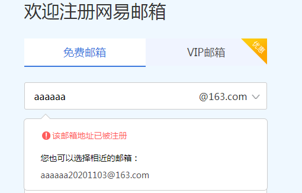
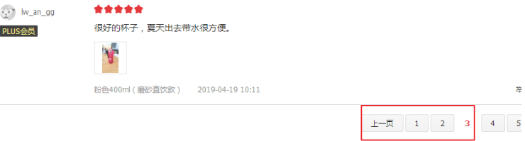
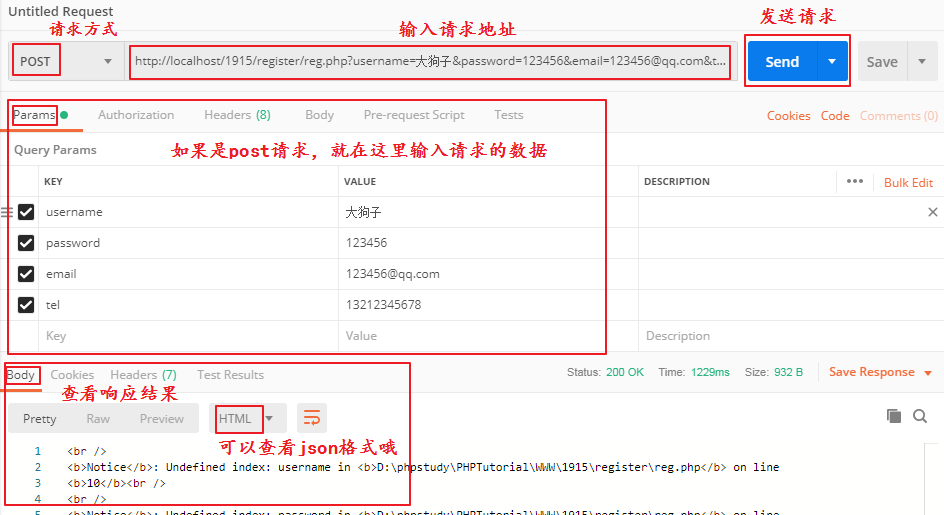

## AJAX

### 概念

一般情况下，前端和后台进行交互都需要页面跳转才能获取到新的数据，然后重新跳转到一个页面，将数据加载到页面上。这对资源的消耗很大，用户体验感也不是很好。

所以js提供了一个不需要刷新页面就能加载后台数据的技术：AJAX

AJAX可以<font color="red">不刷新页面</font>发送http请求，接收到服务器给客户端的数据。

AJAX，全称：`async javascript and XML`，是一个异步执行的和后台交互的技术。

例：

网易邮箱注册

| 网易注册                                  |
| ----------------------------------------- |
|  |

当我们输入用户名，再输入下一项的时候，会有提示说输入的用户名是否可用，但是页面是没有刷新的。

京东的评论页面

| 京东分页                                  |
| ----------------------------------------- |
|  |

点击下一页的时候，评论列表的内容会改变，但是页面是没有刷新的。

还有百度的搜索。。。

这都是ajax做的。

<font color="red">**ajax最大的特点：不刷新页面发送http请求**</font>

### 感知AJAX

三级联动并获取天气信息。

### AJAX的优势

-  不需要插件支持（一般浏览器且默认开启 JavaScript 即可）

* 用户体验极佳（不刷新页面即可获取可更新的数据）
* 提升 Web 程序的性能（在传递数据方面做到按需放松，不必整体提交）
* 减轻服务器和带宽的负担（将服务器的一些操作转移到客户端）
* 缺点：搜索引擎的支持度不够（因为搜索引擎爬虫 *暂时* 还不能理解 JS 引起变化数据的内容）

### AJAX的书写

1. 创建ajax对象，相当于要打电话了，先要安装一部电话

   ```js
   var AJAX=new XMLHttpRequest(); // 这种写法在ie下是不能兼容的
   var AJAX = new ActiveXObject("Microsoft.XMLHTTP"); // 兼容ie678
   var AJAX = new ActiveXObject("Msxml2.XMLHTTP"); // 更低版本ie
   ```

   兼容所有浏览器的兼容写法

   ```js
   function createAJAX(){
   	var AJAX = null;
       if(window.XMLHttpRequest){
           AJAX=new XMLHttpRequest();
       }else if(window.ActiveXObject){
           AJAX = new ActiveXObject("Microsoft.XMLHTTP");
       }else{
           alert("请升级浏览器");
       }
       return AJAX;
   }
   ```

   

2. 建立一个http请求，相当于打电话的时候开始拨号

   ```js
   AJAX.open(请求方式,请求地址,true);
   ```

   参数1：请求方式：get/post

   参数2：请求地址

   参数3：true是异步请求，false是同步请求

3. 监听ajax请求状态的改变，绑定事件的处理程序，等待对方接起电话

   ```js
   AJAX.onreadystatechange = function(){
       if (AJAX.readyState == 4 && AJAX.status == 200) {
           AJAX.responseText; // 从服务器返回的文本信息
       }
   };
   ```

   说明：

   - onreadystatechange是状态改变事件，只要ajax状态发生改变就会触发这个事件

   - readyState是ajax对象请求的状态：

     ​		0：未初始化，对象已经建立，但是还未初始化，就是还未调用send方法

     ​		1：已经初始化，但是还没有调用send方法

     ​		2：发送数据，send方法已经调用，但是http头未知

     ​		3：数据接收中，已经接收部分数据，因为响应以及http头不全，这是通过responseText获取少部分数据会出现错误

     ​		4：请求完成，数据接收完毕，此时可以通过responseText获取完整的相应数据

   - responseText是接收服务器响应的字符串数据，如果是xml数据使用responseXML来接收，如果是json数据，其实也是使用字符串形式相应回来的，使用responseText接收以后，使用JSON.parse(str)或str.parseJSON()转为json对象处理

   ```shell
   AJAX状态码说明
   1##：请求收到，继续处理
   2##：操作成功收到，分析、接受
   3##：完成此请求必须进一步处理
   4##：请求包含一个错误语法或不能完成
   5##：服务器执行一个完全有效请求失败
   100——客户必须继续发出请求
   101——客户要求服务器根据请求转换HTTP协议版本
   200——交易成功
   201——提示知道新文件的URL     
   202——接受和处理、但处理未完成
   203——返回信息不确定或不完整
   204——请求收到，但返回信息为空
   205——服务器完成了请求，用户代理必须复位当前已经浏览过的文件
   206——服务器已经完成了部分用户的GET请求
   300——请求的资源可在多处得到
   301——删除请求数据
   302——在其他地址发现了请求数据
   303——建议客户访问其他URL或访问方式
   304——客户端已经执行了GET，但文件未变化
   305——请求的资源必须从服务器指定的地址得到
   306——前一版本HTTP中使用的代码，现行版本中不再使用
   307——申明请求的资源临时性删除
   400——错误请求，如语法错误
   401——请求授权失败
   402——保留有效ChargeTo头响应
   403——请求不允许
   404——没有发现文件、查询或URl
   405——用户在Request-Line字段定义的方法不允许
   406——根据用户发送的Accept拖，请求资源不可访问
   407——类似401，用户必须首先在代理服务器上得到授权
   408——客户端没有在用户指定的饿时间内完成请求
   409——对当前资源状态，请求不能完成
   410——服务器上不再有此资源且无进一步的参考地址
   411——服务器拒绝用户定义的Content-Length属性请求
   412——一个或多个请求头字段在当前请求中错误
   413——请求的资源大于服务器允许的大小
   414——请求的资源URL长于服务器允许的长度
   415——请求资源不支持请求项目格式
   416——请求中包含Range请求头字段，在当前请求资源范围内没有range指示值，请求也不包含If-Range请求头字段
   417——服务器不满足请求Expect头字段指定的期望值，如果是代理服务器，可能是下一级服务器不能满足请求
   500——服务器产生内部错误
   501——服务器不支持请求的函数
   502——服务器暂时不可用，有时是为了防止发生系统过载
   503——服务器过载或暂停维修
   504——关口过载，服务器使用另一个关口或服务来响应用户，等待时间设定值较长
   505——服务器不支持或拒绝支请求头中指定的HTTP版本
   ```

4. 发送请求，拨出号码

   ```js
   ajax.send(null);
   ```

如果是post请求的话，需要在发送请求前，设置post请求头，模拟表单来传递数据给服务端（否则获取不到send中的参数）

```js
ajax.setRequestHeader('content-type', 'application/x-www-form-urlencoded')
```

send发送请求的时候要携带请求参数（键1=值1&键2=值2）

```js
ajax.send('name=Jack&age=18&gender=男')
```

### 请求示例

#### get请求

html代码：

```html
<body>
<div class="box"></div>
<button id="btn">获取当前时间</button>
</body>
<script type="text/javascript">
function createAjax(){
    var Ajax = null;
    if(window.XMLHttpRequest){
        Ajax =  new XMLHttpRequest();
    }else if(window.ActiveXobject){
        Ajax = new ActiveXObject("Microsoft.XMLHTTP");
    }else{
        alert("请升级浏览器");
        return false;
    }
    return Ajax;
}
document.querySelector("#btn").onclick=function(){
    var ajax = createAjax();
    ajax.open("get","ajax.php",true);
    ajax.onreadystatechange = function(){
        if(ajax.status == 200 && ajax.readyState == 4){
            document.querySelector(".box").innerText = ajax.responseText;
        }
    }
    ajax.send(null);
}
</script>
```

php代码：

```php
date_default_timezone_set("PRC");
echo date("Y-m-d H:i:s",time());
```

#### post请求

html代码：

```html
<body>
<style>
ul{
    list-style:none;
    padding: 0;
    margin: 0;
}

</style>
<h1>获取省下的市</h1>
省份名称：<input type="text" name="province">
<button id="btn">获取</button>
<ul></ul>
</body>
<script type="text/javascript">
function createAjax(){
    var Ajax = null;
    if(window.XMLHttpRequest){
        Ajax = new XMLHttpRequest();
    }else if(window.ActiveXobject){
        Ajax = new ActiveXobject("Microsoft.XMLHTTP");
    }else{
        alert("请升级浏览器");
        return false;
    }
    return Ajax;
}
document.querySelector("#btn").onclick=function(){
    var ajax = createAjax();
    ajax.open("post","postAjax.php",true);
    ajax.onreadystatechange=function(){
        if(ajax.status == 200 && ajax.readyState == 4){
            var ul = document.querySelector("ul");
            var arrText = ajax.responseText;
            // console.log(typeof arrText); // string
            var arr = JSON.parse(arrText);
            ul.innerHTML = '';
            for(var i=0;i<arr.length;i++){
                var li = document.createElement("li");
                li.innerText = arr[i];
                ul.appendChild(li);
            }
        }
    }
    ajax.setRequestHeader("content-type","application/x-www-form-urlencoded");
    var pname = document.querySelector("[name='province']").value.trim();
    ajax.send("province="+pname);
}
</script>
```

php代码：

```php
$arr = [
    "山东"=>[
        "济南",
        "威海",
        "郓城",
        "大明湖畔"
    ],
    "河北"=>[
        "石家庄",
        "衡水",
        "保定",
        "张家口"
    ]
];
$pname = $_POST["province"];
foreach($arr as $k=>$v){
    if($k==$pname){
        echo json_encode($v);
    }
}
```

#### 接收的数据

接收不同数据类型（text、xml、json）

- 接收文本

  ```javascript
  var response = ajax.responseText;
  ```

  

- 接收xml

  ```javascript
  var xml = ajax.responseXML;
  ```

  

- 接收json

  ```javascript
  var json = ajax.responseText;
  var obj = JSON.parse(json);
  ```

  

### 封装通用的ajax

```js
function Ajax(obj){
    var ajax = null;
    if(window.XMLHttpRequest){
        ajax = new XMLHttpRequest();
    }else if(window.ActiveXobject){
        ajax = new ActiveXobject("Microsoft.XMLHTTP");
    }else{
        alert("请升级浏览器");
        return false;
    }
    obj.method = obj.method || "get"; // 默认发送get请求
    if(!obj.url){
       throw new Error("请求地址不能为空");
    }
    if(Object.prototype.toString.call(obj.method) != "[object String]"){
       throw new Error("请求地址必须是字符串");
    }else if(obj.method != "get" && obj.method != "post"){
        throw new Error("请求地址必须是get或者是post");
    }
    if(Object.prototype.toString.call(obj.url) != "[object String]"){
       throw new Error("请求地址必须是字符串");
    }
    if(obj.async == "undefined"){
    	   obj.async = true;
    }
    if(Object.prototype.toString.call(obj.async) != "[object Boolean]"){
       throw new Error("是否异步的参数必须是布尔值");
    }
     if(obj.data != "undefined"){
         if(Object.prototype.toString.call(obj.data) == "[object String]"){
             if(obj.data.indexOf("&")>=0){
                 if(obj.method == "get"){
                    obj.url += "?"+obj.data;
                 }else if(obj.method == "post"){
                     var str = obj.data;
                 }
             }else{
                 throw new Error("携带的参数格式不对，字符串必须是带'='符号的键值对");
             }
         }else if(Object.prototype.toString.call(obj.data) == "[object Object]"){
         	 var str = '';
             for(var attr in obj.data){
                 str += attr + "=" + obj.data[attr];
             }
         }else{
             throw new Error("携带的参数格式不对，需要字符串或者对象");
         }
    }
    if(obj.success == "undefined"){
        obj.success = function(res){}
    }
    if(obj.error == "undefined"){
        obj.error = function(){}
    }
    if(Object.prototype.toString.call(obj.success) != "[object Function]" || Object.prototype.toString.call(obj.error) != "[object Function]"){
        throw new Error("回调函数必须是函数");
    }
    ajax.open(obj.method,obj.url,obj.async)
    ajax.onreadystatechange=function(){
        if(ajax.readyState == 4){
            if(ajax.status>=200 && ajax.status<300){
                var res;
                switch(obj.dataType){
                    case undefined:
                    case "json":
                        res = JSON.parse(ajax.responseText);
                    break;
                    case "string":
                        res = ajax.responseText;
                    break;
                    case "xml":
                        res = ajax.responseXML;
                    break;
                    default:
                        throw new Error("期望的数据格式参数传入错误！");
                	}
               obj.success(res);
            }else{
                obj.error();
            }
        }
    }
    if(obj.method=='post'){
        ajax.setRequestHeader("content-type","application/x-www-form-urlencoded");
		if(obj.data != undefined){
			ajax.send(str);
			return;
		}
    }
    ajax.send();
}
```

调用：

```js
var pname = document.querySelector("[name='province']").value.trim();
    var response = Ajax({
        data:{province:pname},
        url:"postAjax.php",
        method:"post",
        asyn:true,
        success:function(res){
            var arr = JSON.parse(res);
            var ul = document.querySelector("ul");
            ul.innerHTML = '';
            for(var i=0;i<arr.length;i++){
                var li = document.createElement("li");
                li.innerText = arr[i];
                ul.appendChild(li);
            }
        }
    });
```

### postman测试

| postman使用                               |
| ----------------------------------------- |
|  |

get和post的区别：

1. get请求的数据展示在地址栏，post在http请求的请求主体中
2. get请求的数据长度有限制，post没有限制，除非在服务器设置限制
3. get请求的数据格式有限制，必须是url编码的，post的数据没有限制
4. get请求不如post安全
5. get请求容易有缓存，post没有缓存

